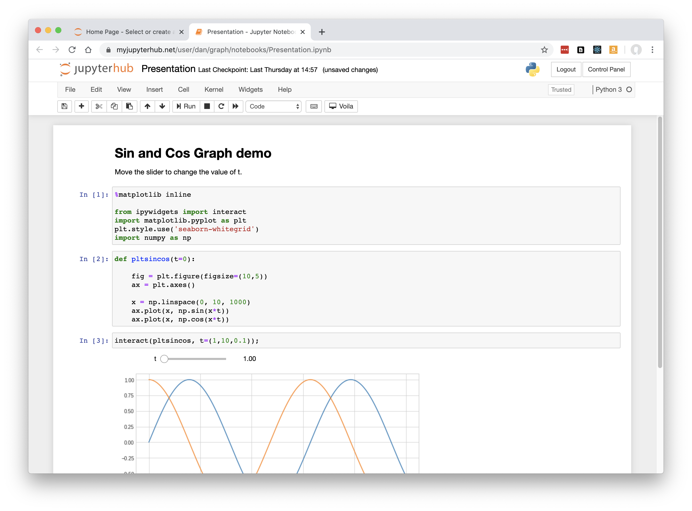
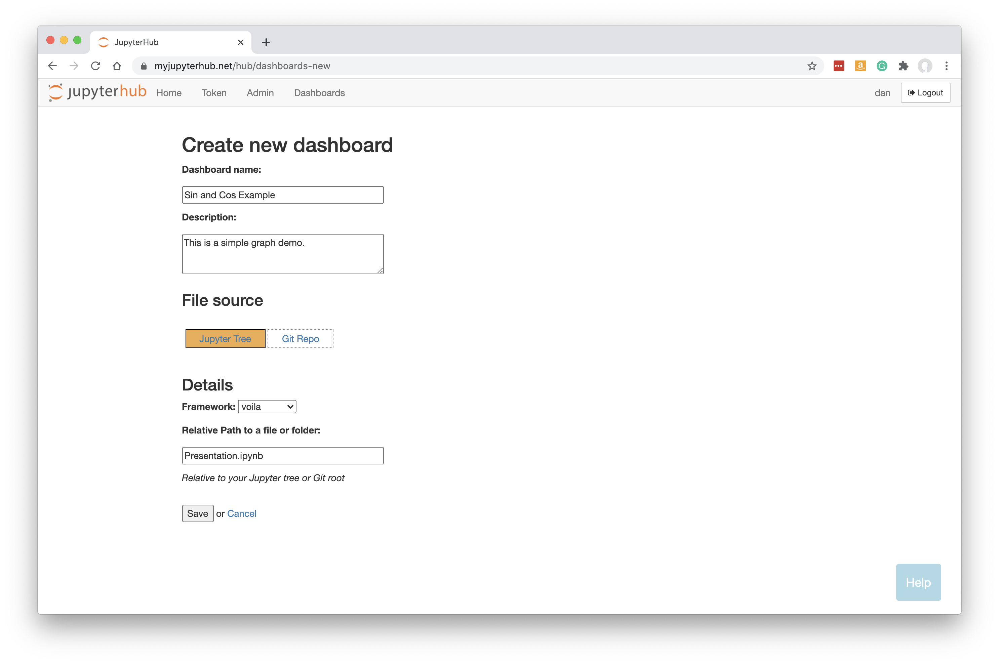
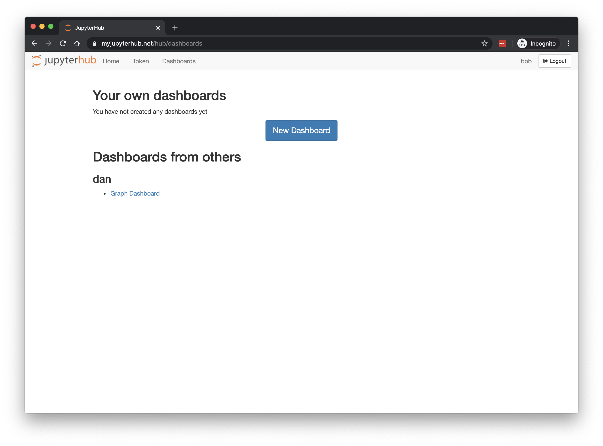
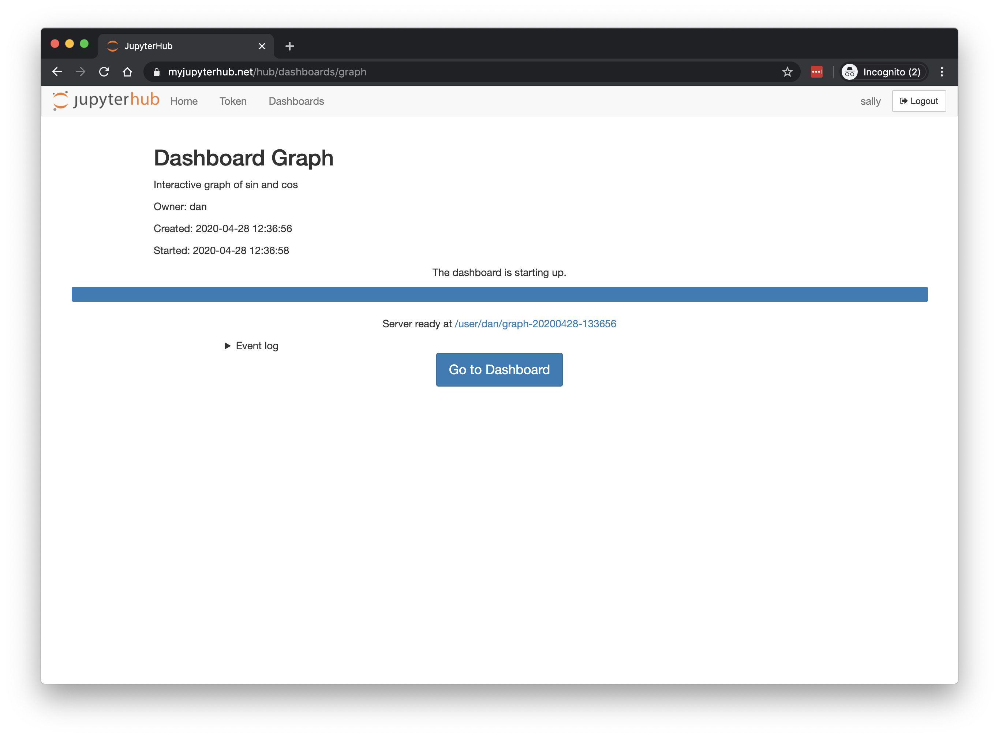

# ContainDS Dashboards for JupyterHub

A Dashboard publishing solution for Data Science teams to share results with decision makers.

Run a private on-premise or cloud-based JupyterHub with extensions to instantly publish apps and notebooks as user-friendly 
interactive dashboards to share with non-technical colleagues.

Currently supported frameworks:
- Jupyter notebooks ([Voila](https://voila.readthedocs.io/en/stable/))
- [Streamlit](https://streamlit.io/) apps
- [Plotly Dash](https://plotly.com/dash/) apps
- [Bokeh](https://docs.bokeh.org/) / [Panel](https://panel.holoviz.org/) apps and notebooks

This open source package allows users to create interactive Jupyter notebooks that can be instantly and reliably published as 
secure interactive web apps.

Any authorised JupyterHub user can view the dashboard.

See [full documentation](https://cdsdashboards.readthedocs.io/).

## How it works

- Data scientist creates a Jupyter Notebook as normal or uploads Python files
- Data scientist creates a new Dashboard to clone their Jupyter server
- Other logged-in JupyterHub users see the dashboard in their list
- Click to launch as a server, using OAuth to gain access
- User sees a safe user-friendly version of the original notebook - served by Voila, Streamlit, Dash, Bokeh etc.

All of this works through a new Dashboards menu item added to JupyterHub's header.

_Data scientist creates a Jupyter Notebook as normal_

_Data scientist creates a new Dashboard to clone their Jupyter server_

_Other logged-in JupyterHub users see the dashboard in their list_

_Click to launch as a server_

_Uses OAuth to gain access_

_Other user sees a safe user-friendly Voila version of the original notebook_

_Or a Streamlit app_

## Requirements

Basic requirements:

- JupyterHub 1.0+
- Python 3.6+

You should be able to use any authenticator for users to login - for example, corporate Google email sign in, or LDAP.

Any JupyterHub distribution should be suitable, depending on configuration. See [requirements](https://cdsdashboards.readthedocs.io/en/stable/chapters/requirements.html).

## Installation

Full [Setup and Installation details](https://cdsdashboards.readthedocs.io/en/stable/chapters/setup/setup.html) are in the documentation.

## Contact and Support

This software is an alpha version. Please see LICENSE for details.

Please do get in touch if you try out the package, or would like to but need some support. I would be very interested to find out how it can be used, and to work (without charge) to help you get it running. The project needs feedback in order to develop further!

For more background on this project and our related ContainDS Desktop product, please see our website: [containds.com](https://containds.com/).

Contact [support@containds.com](mailto:support@containds.com) with any comments or questions at all. Thank you.

