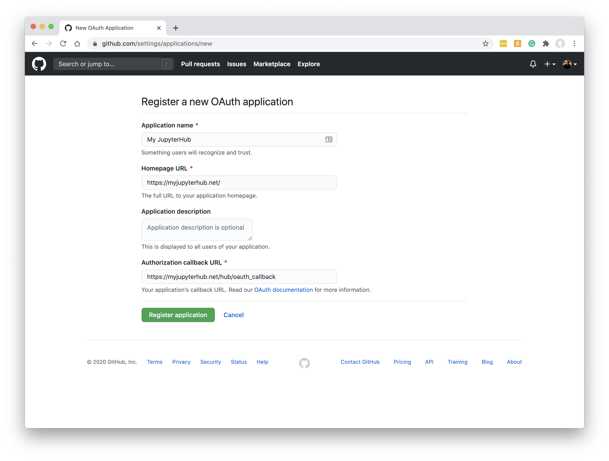
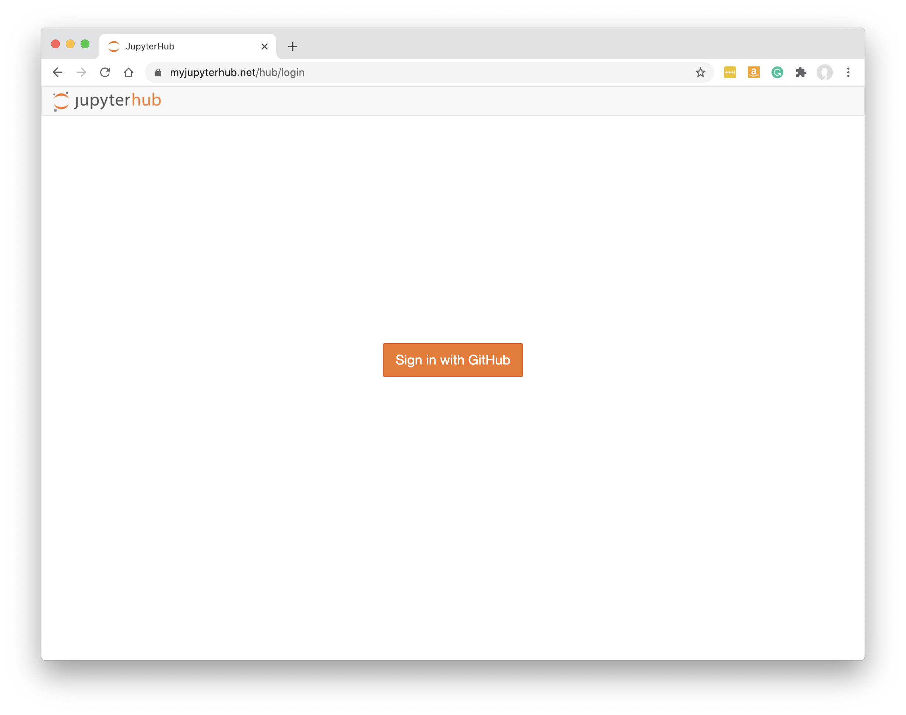

.. _github:

GitHub for Login and Repos
==========================

There are two components of GitHub integration that can be explored: easy one-click login based on GitHub accounts, and ensuring users can easily 
pull from and push to your organization's GitHub repos. Even better, you can connect the two and use 'tokens' provided during the login process 
to push/pull from repos later on.

To start with, we will configure basic GitHub login, and then progress to using the login tokens for repo access.

It is also possible to use similar 
techniques to provide GitHub access tokens to your Jupyter and dashboard environments without requiring GitHub login (see 
:ref:`gitconfig_within_servers`).

Basic GitHub Login
~~~~~~~~~~~~~~~~~~

Install the oauthenticator package into your Hub environment, e.g. :code:`python -m pip install oauthenticator`.

Add the following to your jupyterhub_config.py file:

::

    from oauthenticator.github import GitHubOAuthenticator
    c.JupyterHub.authenticator_class = GitHubOAuthenticator

Alternatively, use the LocalGitHubOAuthenticator class instead of you want users to also be created on the local system.

Register a new GitHub OAuth application on GitHub at https://github.com/settings/applications/new:

If your JupyterHub is at :code:`https://myjupyterhub.net/` then the 'Authorization callback URL' should be at 
:code:`https://myjupyterhub.net/hub/oauth_callback`

Once submitted, you should see a Client ID and Client Secret string. These need to be passed to your JupyterHub config somehow (along with your 
Authorization callback URL).

They can be passed via environment variables like this, where the GitHubOAuthenticator will read them directly:

::

    export OAUTH_CALLBACK_URL=https://myjupyterhub.net/hub/oauth_callback
    export OAUTH_CLIENT_ID=3269e194f4dd95ba5dcd
    export OAUTH_CLIENT_SECRET=182d5bc60c3999fe2e458d186e56ab34c808f3db

or explicitly in jupyterhub_config:

::

    c.GitHubOAuthenticator.oauth_callback_url = 'https://myjupyterhub.net/hub/oauth_callback'
    c.GitHubOAuthenticator.client_id = '3269e194f4dd95ba5dcd'
    c.GitHubOAuthenticator.client_secret = '182d5bc60c3999fe2e458d186e56ab34c808f3db'

Of course, you must use the values provided by GitHub, not the example values shown above.

For The Littlest JupyterHub, you can set these values via the command line 
as `described here <https://tljh.jupyter.org/en/latest/howto/auth/github.html>`__.

For Zero2JupyterHub (on Kubernetes) `see here <https://zero-to-jupyterhub.readthedocs.io/en/latest/administrator/authentication.html>`__.

Users should now be able to login with GitHub:

If you are using GitHub Enterprise, you also need to set a GITHUB_HOST env var to be your GitHub URL.

Obtaining GitHub access tokens
~~~~~~~~~~~~~~~~~~~~~~~~~~~~~~

You can extend the GitHub login process so that it also provides access tokens for GitHub repos. Then you can pass these into the dashboard and 
Jupyter environments to be used whenever git pushes/pulls repos.

Passing GitHub Tokens to Servers
--------------------------------

This updated jupyterhub_config shows an example:

::

    from oauthenticator.github import GitHubOAuthenticator
    c.GitHubOAuthenticator.scope = ['read:org', 'public_repo', 'repo', 'user:email']

    class MyGitHubAuthenticator(GitHubOAuthenticator):
        
        from tornado import gen

        @gen.coroutine
        def pre_spawn_start(self, user, spawner):
            auth_state = yield user.get_auth_state()
            if not auth_state:
                # user has no auth state
                return
            # define some environment variables from auth_state
            spawner.environment['GITHUB_TOKEN'] = auth_state['access_token']
            spawner.environment['GITHUB_USER'] = auth_state['github_user']['login']
            spawner.environment['GITHUB_EMAIL'] = auth_state['github_user']['email']

    c.JupyterHub.authenticator_class = MyGitHubAuthenticator

GitHub needs to be instructed to collect extra permissions during the login process - most importantly, the public_repo and repo (for private repos) 
scopes must be added through the c.GitHubOAuthenticator.scope setting as shown above.

A bespoke version of GitHubOAuthenticator is then defined, adding a pre_spawn_start function that is called every time a new Jupyter server or 
dashboard server is created. It passes on the GitHub tokens and other information obtained when the user logged in.

However, to ensure the tokens/info can be stored safely in the JupyterHub database, you also need to enable something in JupyterHub called 'auth state'. 
This requires cryptographic packages that can slow things down so are not enabled by default. Without enabling auth state explicitly, the bespoke 
authenticator above will never receive any auth_state, so the env vars will never be set.

You need to set an enable_auth_state config setting and also generate a JUPYTERHUB_CRYPT_KEY value.

To generate a JUPYTERHUB_CRYPT_KEY value, run :code:`openssl rand -hex 32` from the command line.

In jupyterhub_config, enable auth state:

::

    c.GitHubOAuthenticator.enable_auth_state = True

Ideally, set JUPYTERHUB_CRYPT_KEY as an environment variable. Otherwise, it can be set in jupyterhub_config:

::

    c.CryptKeeper.keys = [ 'f871c4cce4c5bf94a4147dd36f6f219e4e223b38962c355ac60628f431582b41' ]

To do all of this section under `Zero2JupyterHub <https://zero-to-jupyterhub.readthedocs.io/en/latest/reference/reference.html#auth-state>`__ 
(on Kubernetes) set the following in your config.yaml file:

.. parsed-literal::
    
    hub:
      auth:
        state:
          enabled: True
          cryptoKey: f871c4cce4c5bf94a4147dd36f6f219e4e223b38962c355ac60628f431582b41

    extraConfig:
      my-github-auth: \|
        <The bespoke authentication snippet from above>

The GitHub tokens should now be available within new Jupyter/dashboard servers, but just stored within environment variables. 
Next, you need to use those values within the git configuration of the Jupyter server.

.. _gitconfig_within_servers:

Picking up Git Config within Servers
------------------------------------

Setting the Git config to use the access token and usernames provided in the last step can be the same for regular Jupyter servers as 
it is for dashboard servers.

This is the basic shell script to set GitHub tokens and user info for the git config of a new Jupyter server:

.. parsed-literal::

    if [ "${GITHUB_TOKEN}" != "" ]; then

        if [ -z "${GITHUB_HOST}" ]; then
            GITHUB_HOST=github.com
        fi

        git config --global --replace-all user.email "${GITHUB_EMAIL}"
        git config --global --replace-all user.name "${GITHUB_NAME}"
        git config --global --replace-all user.ghtoken "${GITHUB_TOKEN}"
        git config --global --replace-all push.default simple
        git config --global --replace-all url."https://${GITHUB_USER}:${GITHUB_TOKEN}@${GITHUB_HOST}".insteadOf "https://${GITHUB_HOST}"
        git config --global --replace-all url."https://${GITHUB_USER}:${GITHUB_TOKEN}@${GITHUB_HOST}/".insteadOf "git@${GITHUB_HOST}:"
    fi

If you are using a Docker-based JupyterHub (e.g. KubeSpawner or DockerSpawner) you can build a custom image that copies the above script into 
:code:`/usr/local/bin/before-notebook.d`. See the Dockerfile and github-tokens.sh files in 
`this example <https://github.com/ideonate/cdsdashboards/tree/master/docker-images/singleuser-example/containds-all-example>`__.

For other spawner types, you need to find a way to include the shell script in each users' shell startup process.

If you are using The Littlest JupyterHub, for example, you might copy the shell script snippet above into the /etc/skel/.bashrc file so 
that it is copied into ~/.bashrc for all new users and run whenever a new Jupyter server is started.

Your users should now be able to create dashboards using private GitHub repos as the source (see :ref:`gitrepo`).

If you do not use GitHub login, you could still use a similar shell script to that above in order to set access tokens from another source.
