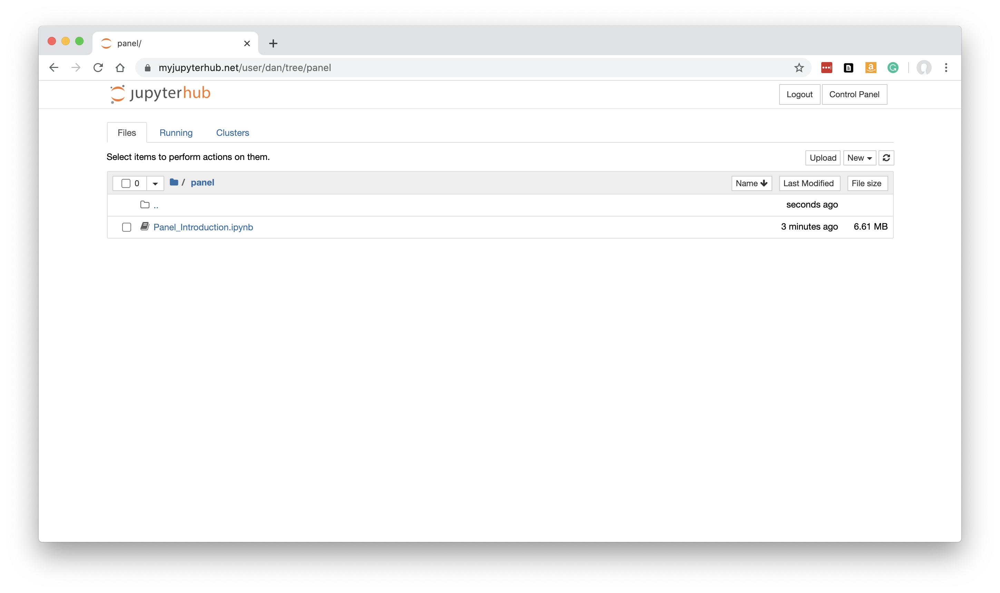
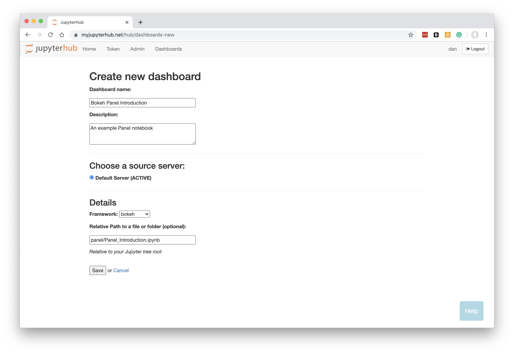
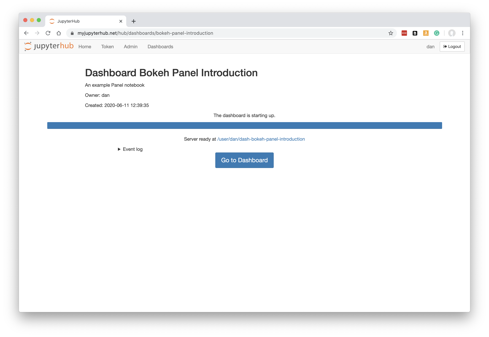

.. _bokehpanel:

Bokeh or Panel apps
-------------------

How to turn your `Bokeh <https://docs.bokeh.org/>`__ or `Panel <https://panel.holoviz.org/>`__ app or notebook into a Dashboard.

Preparing your Code
~~~~~~~~~~~~~~~~~~~

Use 'My Server' (or a named server) to upload any notebooks, or Python files and data, that form your app or notebook.

Below, we have a Panel app in a Jupyter notebook called Panel_Introduction.ipynb. It is in a folder called 'panel'.
To try out this example, you can obtain 
the `source code here <https://github.com/ideonate/cdsdashboards/tree/master/examples/sample-source-code/panel>`__.

Click 'Control Panel' to go back to JupyterHub.

New Dashboard
~~~~~~~~~~~~~

Click 'Dashboards' in the menu bar. You will see the page showing any Dashboards created by you, or shared with you by colleagues.

Below, in a fresh installation of ContainDS Dashboards, there are no Dashboards:

.. figure:: ../../_static/screenshots/userguide/EmptyDashboards.png
   :alt: Empty Dashboards screen

Click 'New Dashboard'.

Fill in a name and optionally a description.

The default My Server should already be selected as the source. If you have other named servers they should be available here. Unless 
different servers are likely to have different files or packages installed, it probably won't make much difference which server is selected 
as the source anyway - most JupyterHubs will share the user's home file system across the different servers, so the Dashboard will 
be able to locate your notebooks and files.

Select the framework required. For our example, we need to change this to *bokeh*.

Specify the URL-path to our Bokeh/Panel app, relative to the Jupyter server's home folder. This can be a Python py file, an ipynb notebook, or a 
folder containing at least a main.py file.

In our case, Panel_Introduction.ipynb was in the 'panel' folder in our Jupyter tree, so we enter panel/Panel_Introduction.ipynb.

**Note that your Dashboard will be accessible by any other JupyterHub user.**

Click 'Save'.

Building the Dashboard
~~~~~~~~~~~~~~~~~~~~~~

When you click Save, the dashboard will be built automatically. This just means that a new named server is created based on your new Dashboard, 
running the Bokeh/Panel server instead of the regular Jupyter server.

This is what you should see while the build is taking place:

Any errors during the build will be visible here.

Once the Dashboard is built, click the 'Go to Dashboard' button to open the dashboard in a new tab.

The Bokeh/Panel app is displayed:

.. figure:: ../../_static/screenshots/userguide/PanelApp.png
   :alt: Dashboard screen

See :ref:`working with dashboards<working>` to understand more about how Dashboards operate, including sharing them with colleagues.

Panel and Voila
~~~~~~~~~~~~~~~

Note that for Panel apps built in ipynb notebooks, it is also possible to select the 'voila' framework to deploy them as dashboards. Voila 
is more closely related to the Jupyter notebook server, whereas selecting 'bokeh' as the framework uses the equivalent of the 'dash serve' command. 
It will most often make sense to select 'bokeh', but it is worth being aware that 'voila' is a possible backup for Panel notebooks.
