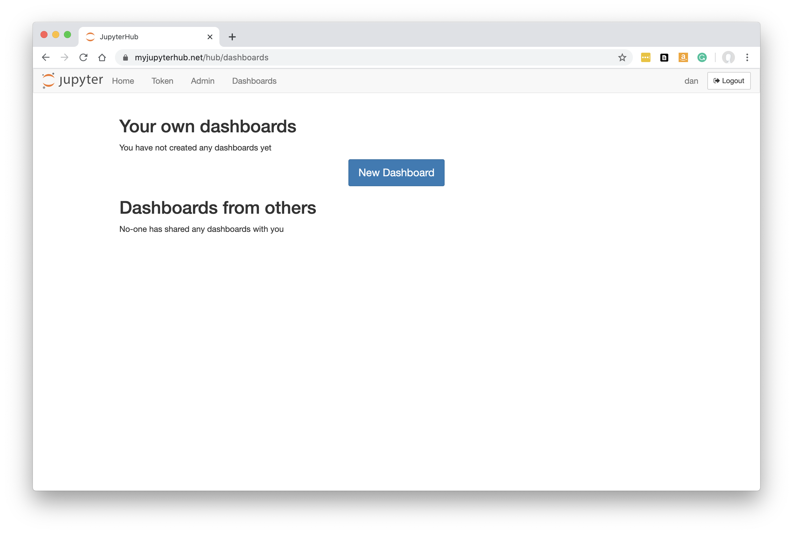
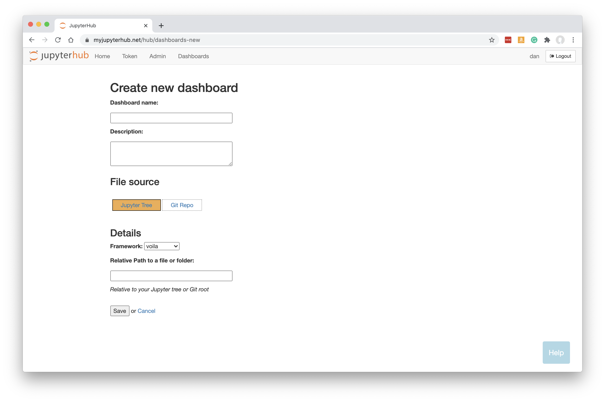
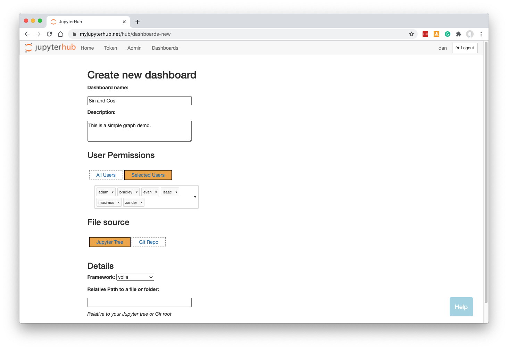
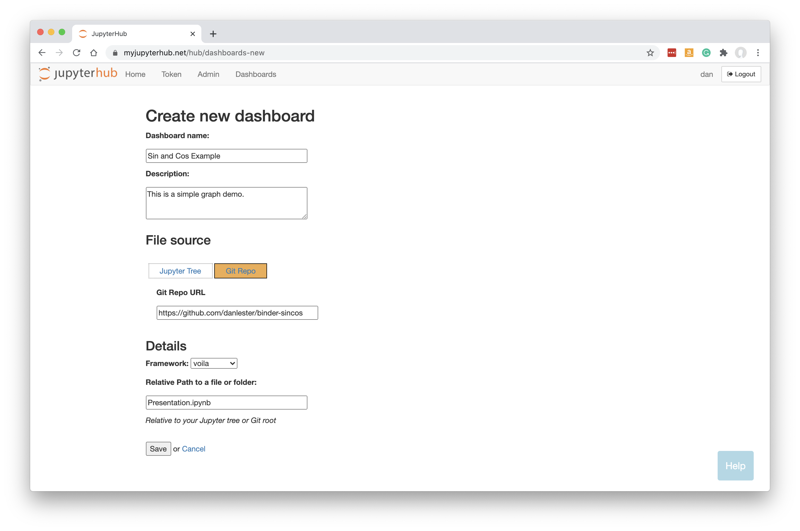

.. _create_dashboard:

Create Dashboard
~~~~~~~~~~~~~~~~

Having :ref:`prepared the dashboard source files <prepare_dashboard>`, you can now deploy it as a dashboard for others to access on 
JupyterHub.

Click on the 'Dashboards' menu in JupyterHub.

Click on 'New Dashboard'.

At the top of the page, fill in a name and optionally a description.

User Permissions
----------------

Click 'All Users' if you want any authenticated user to be able to access your dashboard.

If you want to limit access to selected individual users only, click 'Selected Users' and then type or click on the names of the users 
who should be allowed access:

File Source
-----------

If your files are stored on your Jupyter tree (e.g. they were developed or uploaded through My Server within JupyterHub), just leave 
'Jupyter Tree' selected as the file source.

Alternatively, if your files are coming directly from a git repo, click on 'Git Repo' and then supply the Git Repo URL:

For more information about file sources, please see :ref:`prepare_dashboard`.

Details
-------

Select the framework required. For a Jupyter notebook (ipynb) file, we need to leave this as 'voila'.

The other options are 'streamlit', 'plotlydash', 'bokeh' (for panel too), 'rshiny' - or potentially any other :ref:`custom framework <customlaunchers>` 
you have installed.

If configured for your installation, you may be able to select a Conda environment in which to run the dashboard. 
See :ref:`Conda env configuration details<conda_envs>`.

Specify the URL-path to the ipynb file, relative to the Jupyter server's home folder or to the git repo root. In the first example above, Presentation.ipynb 
was at the top level in our Jupyter tree, so we just enter Presentation.ipynb; and in the second example it was at the root of the git repo.

For some framework types including Voila, you can leave the Relative Path blank or pointing to a folder and Voila will just show the entire tree to the 
dashboard viewer so they can choose between the relevant files for themselves.

**Note that your Dashboard will be accessible by any other JupyterHub user.**

Click 'Save'.

Building the Dashboard
~~~~~~~~~~~~~~~~~~~~~~

When you click Save, the dashboard will be built automatically. This just means that a new named server is created based on your new Dashboard, 
running Voila instead of the regular Jupyter server.

This is what you should see while the build is taking place:

.. figure:: ../../_static/screenshots/userguide/create_dashboard/DashboardBuild.png
   :alt: Dashboard Build screen

Any errors during the build will be visible here.

Once the Dashboard is built, click the 'Go to Dashboard' button to open the dashboard in a new tab.

The user-friendly and safe version of the notebook is displayed:

.. figure:: ../../_static/screenshots/userguide/create_dashboard/DashboardView.png
   :alt: Dashboard screen

See :ref:`working with dashboards<working>` to understand more about how Dashboards operate, including sharing them with colleagues.

