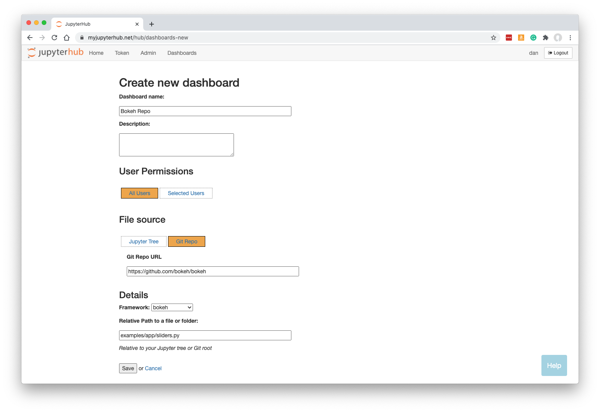
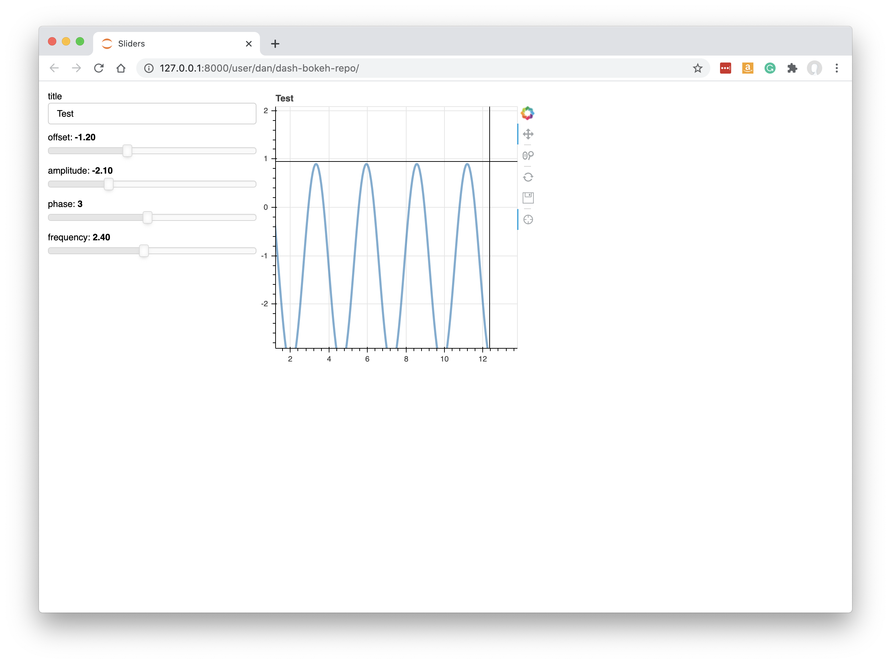

.. _bokehpanel:

Bokeh or Panel apps
-------------------

How to turn your `Bokeh <https://docs.bokeh.org/>`__ or `Panel <https://panel.holoviz.org/>`__ app or notebook into a Dashboard.

Preparing your Code
~~~~~~~~~~~~~~~~~~~

You can use 'My Server' (or a named server) to upload any notebooks, or Python files and data, that form your app or notebook.

In our example, we will take a Bokeh app straight from a GitHub repo. There is an app called 
sliders.py, available on 
`GitHub here <https://github.com/bokeh/bokeh/blob/master/examples/app/sliders.py>`__.

New Dashboard
~~~~~~~~~~~~~

Click 'Dashboards' in the menu bar. Then click 'New Dashboard'.

Fill in a name and optionally a description.

Click 'Git Repo' and enter the URL: :code:`https://github.com/bokeh/bokeh`

Select the framework required. For our example, we need to change this to *bokeh*.

Specify the URL-path to our Bokeh/Panel app, relative to the Jupyter server's home folder. This can be a Python py file, an ipynb notebook, or a 
folder containing at least a main.py file.

In our case, sliders.py is the file we need, but it is a few folders deep in the Git repo, so we enter:

:code:`examples/app/sliders.py`

**Note that your Dashboard will be accessible by any other JupyterHub user.**

Click 'Save'.

Building the Dashboard
~~~~~~~~~~~~~~~~~~~~~~

When you click Save, the dashboard will be built automatically. This just means that a new named server is created based on your new Dashboard, 
but running the Bokeh server instead of Jupyter.

Once the Dashboard is built you will be automatically redirected to it.

The Bokeh/Panel app is displayed:

See :ref:`working with dashboards<working>` to understand more about how Dashboards operate, including sharing them with colleagues.

Panel and Voilà
~~~~~~~~~~~~~~~

Note that for Panel apps built in ipynb notebooks, it is also possible to select the 'voila' framework to deploy them as dashboards. Voilà 
is more closely related to the Jupyter notebook server, whereas selecting 'bokeh' as the framework uses the equivalent of the 'dash serve' command. 
It will most often make sense to select 'bokeh', but it is worth being aware that 'voila' is a possible backup for Panel notebooks.
