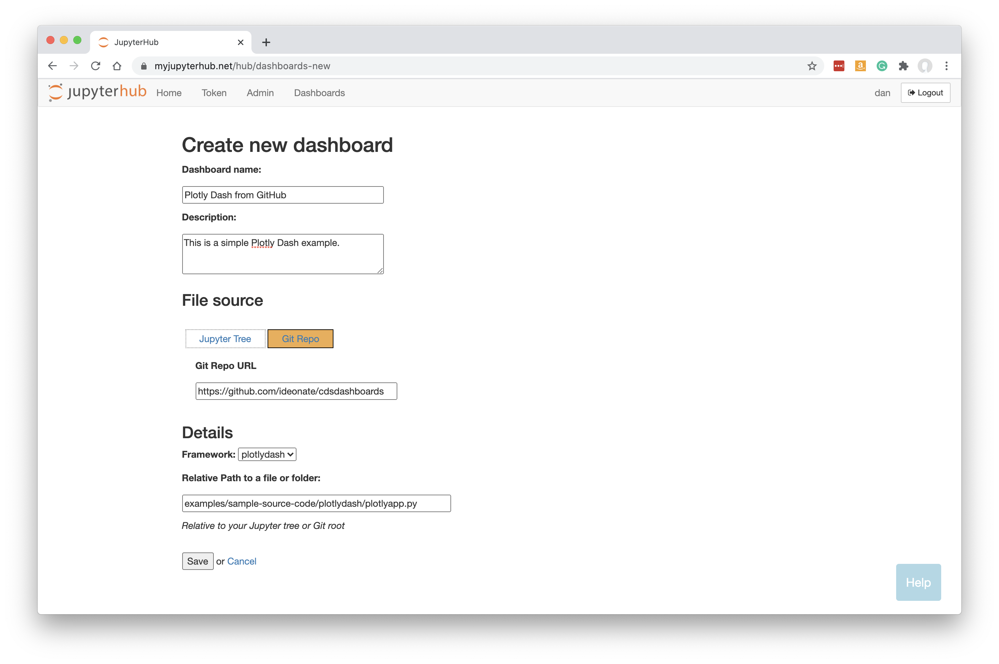
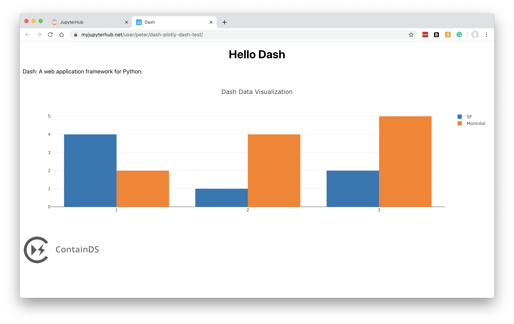

.. _plotlydash:

Plotly Dash Apps
----------------

How to turn your `Plotly Dash <https://plotly.com/dash/>`__ app into a Dashboard.

Preparing your Code
~~~~~~~~~~~~~~~~~~~

In this example, we will source a Plotly Dash app direct from a public GitHub repo.

We have a Dash app in a Python file called plotlyapp.py, along with some files in an assets folder. The 
`source code is here <https://github.com/ideonate/cdsdashboards/tree/master/examples/sample-source-code/plotlydash>`__.

It is preferred if your Dash object is called 'app' in your script, but if 'app' does not exist or is not an object of type dash.Dash, the first 
suitable dash.Dash object will be located and used.

New Dashboard
~~~~~~~~~~~~~

Click 'Dashboards' in the menu bar. Then click 'New Dashboard'.

Fill in a name and optionally a description.

Click 'Git Repo' and enter the URL: :code:`https://github.com/ideonate/cdsdashboards`

Select the framework required. For our example, we need to change this to *plotlydash*.

Specify the URL-path to the Python file of our Dash app, relative to the git repo's root folder. 
In our case, plotlyapp.py was three subfolders deep so we enter:

:code:`examples/sample-source-code/plotlydash/plotlyapp.py`

**Note that your Dashboard will be accessible by any other JupyterHub user.**

Click 'Save'.

Building the Dashboard
~~~~~~~~~~~~~~~~~~~~~~

When you click Save, the dashboard will be built automatically. This just means that a new named server is created based on your new Dashboard, 
running Plotly Dash instead of the regular Jupyter server.

The Plotly Dash app is displayed:

See :ref:`working with dashboards<working>` to understand more about how Dashboards operate, including sharing them with colleagues.
