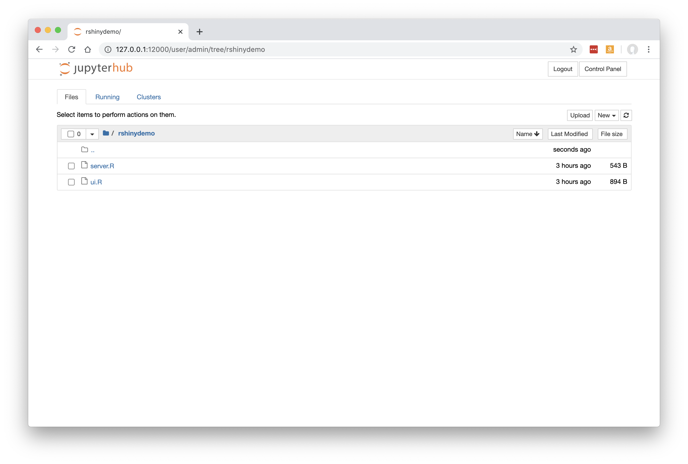
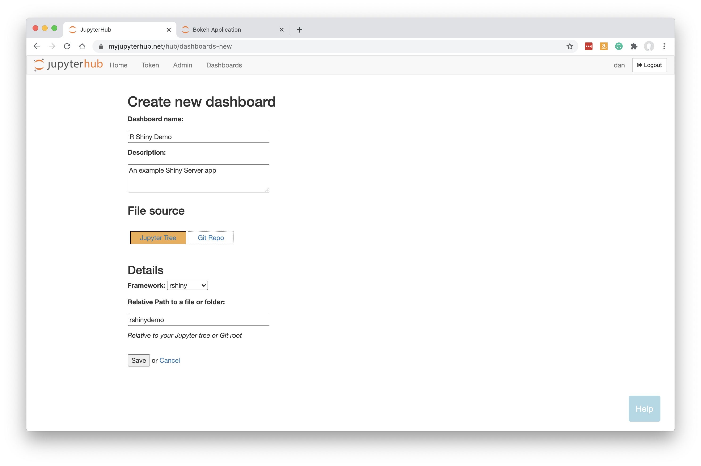
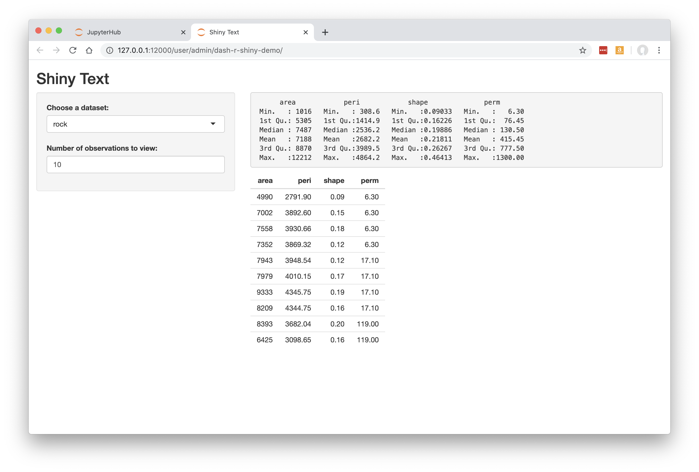

.. _rshiny:

R Shiny Server
--------------

How to build a Dashboard based on R Shiny Server.

Preparing your Code
~~~~~~~~~~~~~~~~~~~

Use 'My Server' (or a named server) to upload ui.R and server.R files into a folder along with any data files or other assets required.

Below, we have these two files uploaded to a folder called `rshinydemo` at the top level of our Jupyter tree. 
To try out this example, you can obtain the 
`source code here <https://github.com/ideonate/cdsdashboards/tree/master/examples/sample-source-code/rshinydemo>`__. 

For this demo you will need :code:`shiny-server` installed and available on the PATH.

Click 'Control Panel' to go back to JupyterHub.

*Please note it is also possible to deploy your app direct from a Git Repo.*

New Dashboard
~~~~~~~~~~~~~

Click 'Dashboards' in the menu bar, then click 'New Dashboard'.

Fill in a name and optionally a description.

Leave 'Jupyter Tree' selected.

Select the framework 'rshiny' from the dropdown list.

Specify the URL-path to the folder, relative to the Jupyter server's home folder. In our case, rshinydemo was at the top level in our 
Jupyter tree, so we just enter rshinydemo.

**Note that your Dashboard will be accessible by any other JupyterHub user.**

Click 'Save'.

Building the Dashboard
~~~~~~~~~~~~~~~~~~~~~~

When you click Save, the dashboard will be built automatically. This just means that a new named server is created based on your new Dashboard, 
running shiny-server instead of the regular Jupyter server.

Once the Dashboard is built you will be automatically redirected to it.

The user-friendly and safe version of the app is displayed:

See :ref:`working with dashboards<working>` to understand more about how Dashboards operate, including sharing them with colleagues.
