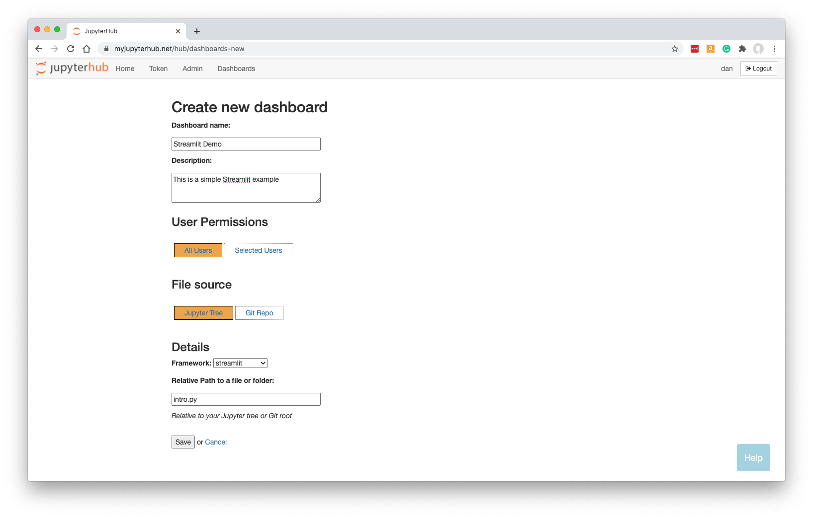
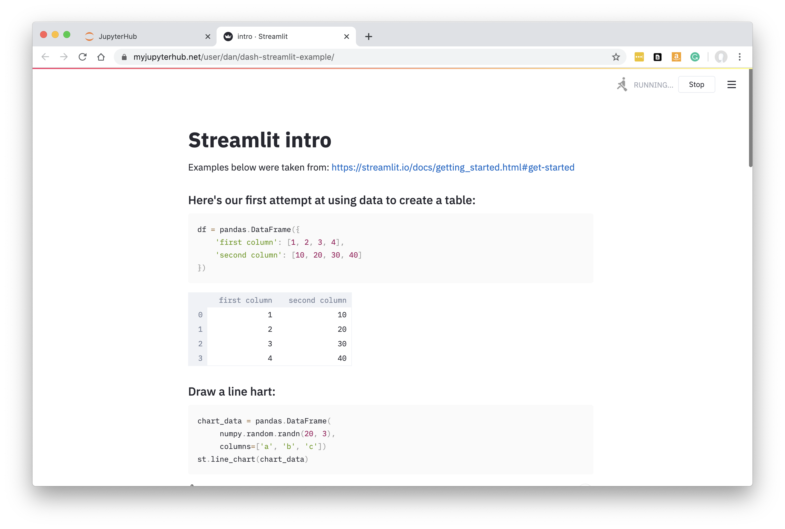

.. _streamlit:

Streamlit Apps
--------------

How to turn your `Streamlit <https://streamlit.io/>`__ app into a Dashboard, from your Jupyter tree.

Preparing your Code
~~~~~~~~~~~~~~~~~~~

Use 'My Server' (or a named server) to upload any Python files and data that form your Streamlit app.

Below, we have a Streamlit app in a Python file called intro.py (we can ignore the ipynb file this time). 
To try out this example, you can obtain the 
`source code here <https://github.com/ideonate/cdsdashboards/tree/master/examples/sample-source-code/streamlit>`__.

.. figure:: ../../../_static/screenshots/userguide/frameworks/JupyterTree.png
   :alt: Jupyter with ipynb and py files

Streamlit apps can't normally be run at this stage (in Jupyter), so for now you would upload Python files and data that you have developed on 
your own machine.

Click 'Control Panel' to go back to JupyterHub.

New Dashboard
~~~~~~~~~~~~~

From the Dashboards page in JupyterHub, click 'New Dashboard'.

Fill in a name and optionally a description.

Select the framework required. For our example, change this to 'streamlit'.

Specify the URL-path to the main py file, relative to the Jupyter server's home folder. In our case, intro.py was at the top level in our 
Jupyter tree, so we just enter intro.py.

**Note that your Dashboard will be accessible by any other JupyterHub user.**

Click 'Save'.

Once the Dashboard is built you will be automatically redirected to it.

The Streamlit app is displayed:

See :ref:`working with dashboards<working>` to understand more about how Dashboards operate, including sharing them with colleagues.

Problems with Components
~~~~~~~~~~~~~~~~~~~~~~~~

If `Streamlit Components <https://www.streamlit.io/components>`__ are not working, please see :ref:`streamlit_components`.
