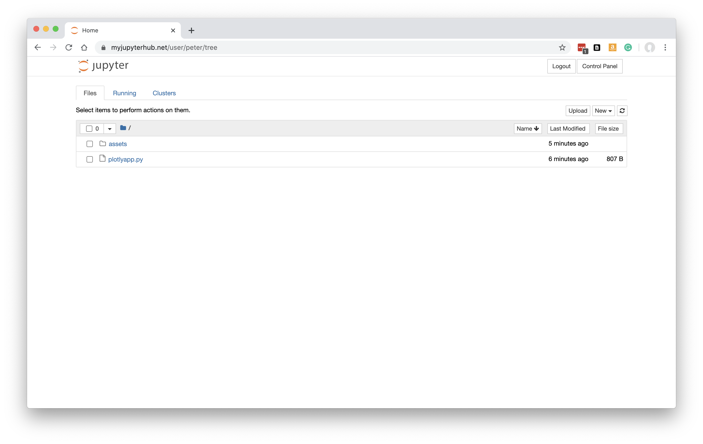
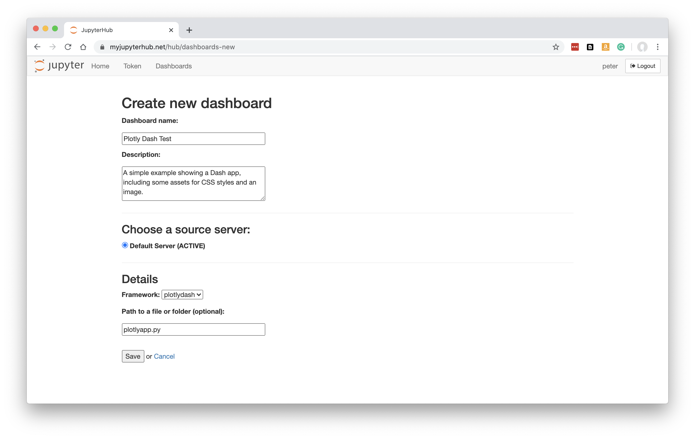
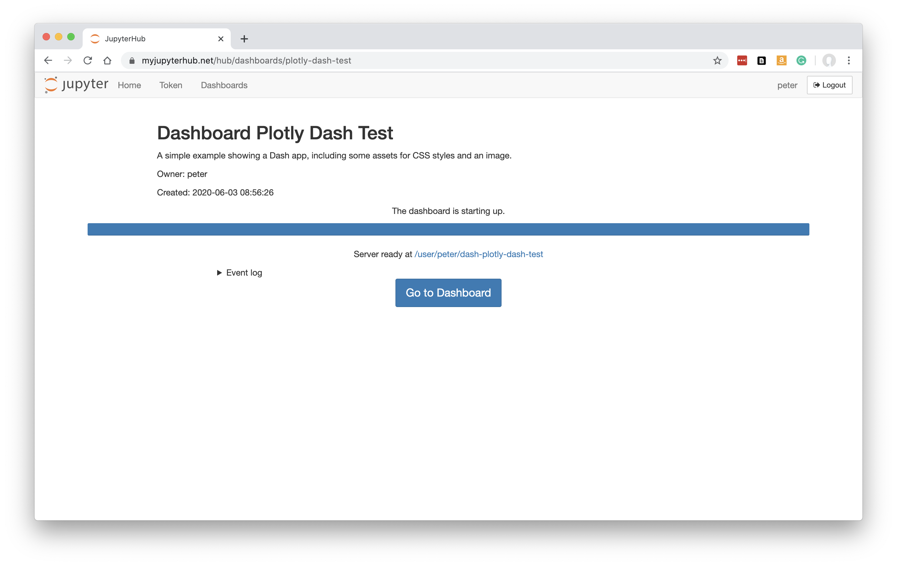

.. _plotlydash:

Plotly Dash Apps
----------------

How to turn your `Plotly Dash <https://plotly.com/dash/>`__ app into a Dashboard.

Preparing your Code
~~~~~~~~~~~~~~~~~~~

Use 'My Server' (or a named server) to upload any Python files and data that form your Dash app.

Below, we have a Dash app in a Python file called plotlyapp.py, along with some files in an assets folder. To try out this example, you can obtain the 
`source code here <https://github.com/ideonate/cdsdashboards/tree/master/examples/sample-source-code/plotlydash>`__.

Plotly Dash apps can't normally be run at this stage (in Jupyter), so for now you would upload Python files and data that you have developed on 
your own machine.

It is preferred if your Dash object is called 'app' in your script, but if 'app' does not exist or is not an object of type dash.Dash, the first 
suitable dash.Dash object will be located and used.

Click 'Control Panel' to go back to JupyterHub.

New Dashboard
~~~~~~~~~~~~~

Click 'Dashboards' in the menu bar. You will see the page showing any Dashboards created by you, or shared with you by colleagues.

Below, in a fresh installation of ContainDS Dashboards, there are no Dashboards:

.. figure:: ../../_static/screenshots/userguide/EmptyDashboards.png
   :alt: Empty Dashboards screen

Click 'New Dashboard'.

Fill in a name and optionally a description.

The default My Server should already be selected as the source. If you have other named servers they should be available here. Unless 
different servers are likely to have different files or packages installed, it probably won't make much difference which server is selected 
as the source anyway - most JupyterHubs will share the user's home file system across the different servers, so the Dashboard will 
be able to locate your notebooks and files.

Select the framework required. For our example, we need to change this to *plotlydash*.

Specify the URL-path to the Python file of our Dash app, relative to the Jupyter server's home folder. In our case, plotlyapp.py 
was at the top level in our Jupyter tree, so we just enter plotlyapp.py.

**Note that your Dashboard will be accessible by any other JupyterHub user.**

Click 'Save'.

Building the Dashboard
~~~~~~~~~~~~~~~~~~~~~~

When you click Save, the dashboard will be built automatically. This just means that a new named server is created based on your new Dashboard, 
running Plotly Dash instead of the regular Jupyter server.

This is what you should see while the build is taking place:

Any errors during the build will be visible here.

Once the Dashboard is built, click the 'Go to Dashboard' button to open the dashboard in a new tab.

The Plotly Dash app is displayed:

.. figure:: ../../_static/screenshots/userguide/PlotlyApp.png
   :alt: Dashboard screen

See :ref:`working with dashboards<working>` to understand more about how Dashboards operate, including sharing them with colleagues.
