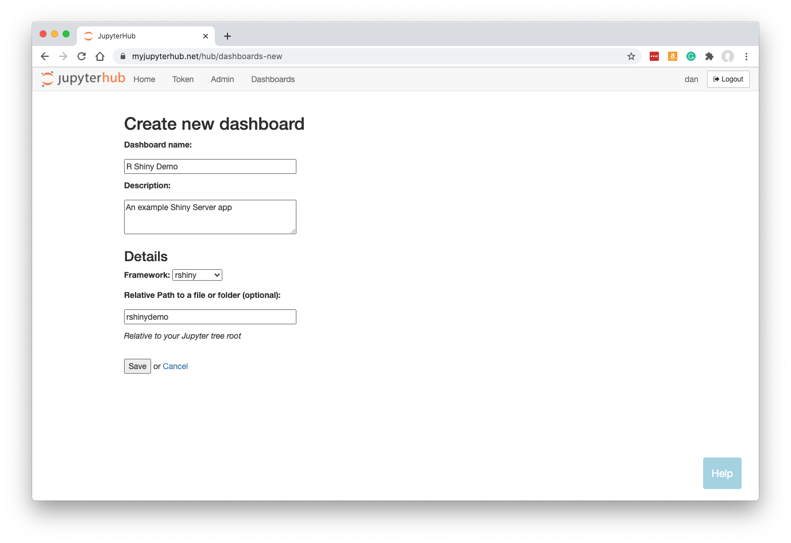
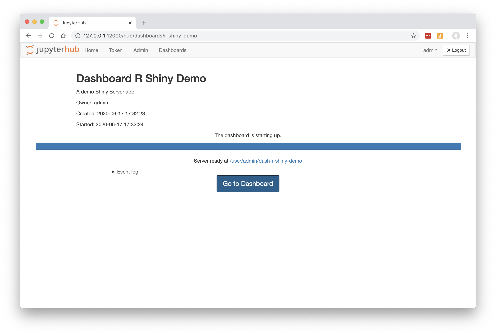

.. _rshiny:

R Shiny Server
--------------

How to build a Dashboard based on R Shiny Server.

Preparing your Code
~~~~~~~~~~~~~~~~~~~

Use 'My Server' (or a named server) to upload ui.R and server.R files into a folder along with any data files or other assets required.

Below, we have these two files uploaded to a folder called `rshinydemo` at the top level of our Jupyter tree. 
To try out this example, you can obtain the 
`source code here <https://github.com/ideonate/cdsdashboards/tree/master/examples/sample-source-code/rshinydemo>`__. 

For this demo you will need shiny-server installed and available on the PATH.

.. figure:: ../../_static/screenshots/userguide/RShinyJupyterTree.png
   :alt: Jupyter with server.R and ui.R files

Click 'Control Panel' to go back to JupyterHub.

New Dashboard
~~~~~~~~~~~~~

Click 'Dashboards' in the menu bar. You will see the page showing any Dashboards created by you, or shared with you by colleagues.

Below, in a fresh installation of ContainDS Dashboards, there are no Dashboards:

.. figure:: ../../_static/screenshots/userguide/EmptyDashboards.png
   :alt: Empty Dashboards screen

Click 'New Dashboard'.

Fill in a name and optionally a description.

The default My Server should already be selected as the source. If you have other named servers they should be available here. Unless 
different servers are likely to have different files or packages installed, it probably won't make much difference which server is selected 
as the source anyway - most JupyterHubs will share the user's home file system across the different servers, so the Dashboard will 
be able to locate your notebooks and files.

Select the framework 'rshiny' from the dropdown list.

Specify the URL-path to the folder, relative to the Jupyter server's home folder. In our case, rshinydemo was at the top level in our 
Jupyter tree, so we just enter rshinydemo.

**Note that your Dashboard will be accessible by any other JupyterHub user.**

Click 'Save'.

Building the Dashboard
~~~~~~~~~~~~~~~~~~~~~~

When you click Save, the dashboard will be built automatically. This just means that a new named server is created based on your new Dashboard, 
running Voila instead of the regular Jupyter server.

This is what you should see while the build is taking place:

Any errors during the build will be visible here.

Once the Dashboard is built, click the 'Go to Dashboard' button to open the dashboard in a new tab.

The user-friendly and safe version of the app is displayed:

.. figure:: ../../_static/screenshots/userguide/RShinyDashboardView.png
   :alt: Dashboard screen

See :ref:`working with dashboards<working>` to understand more about how Dashboards operate, including sharing them with colleagues.
