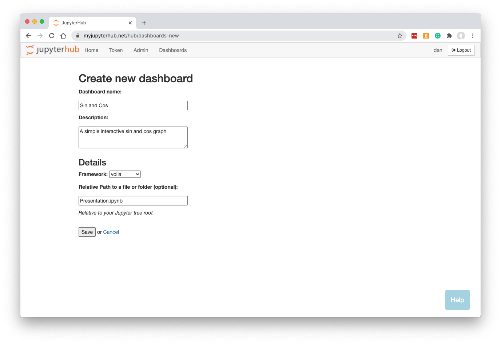
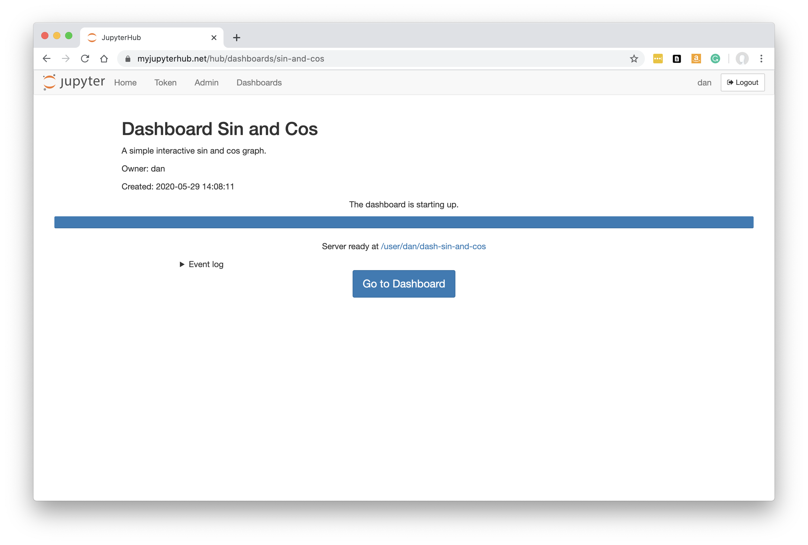
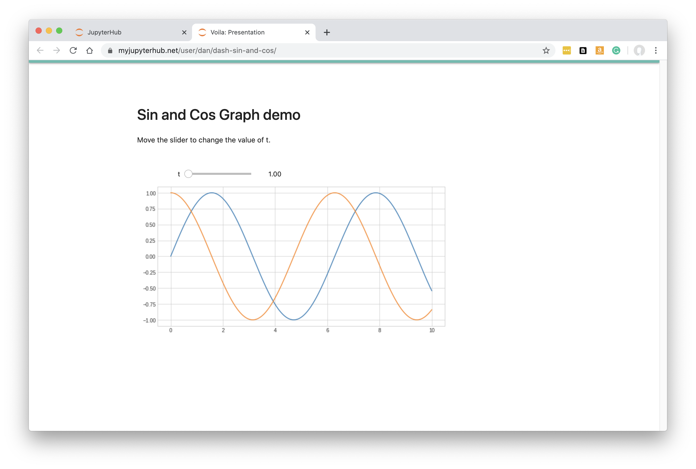
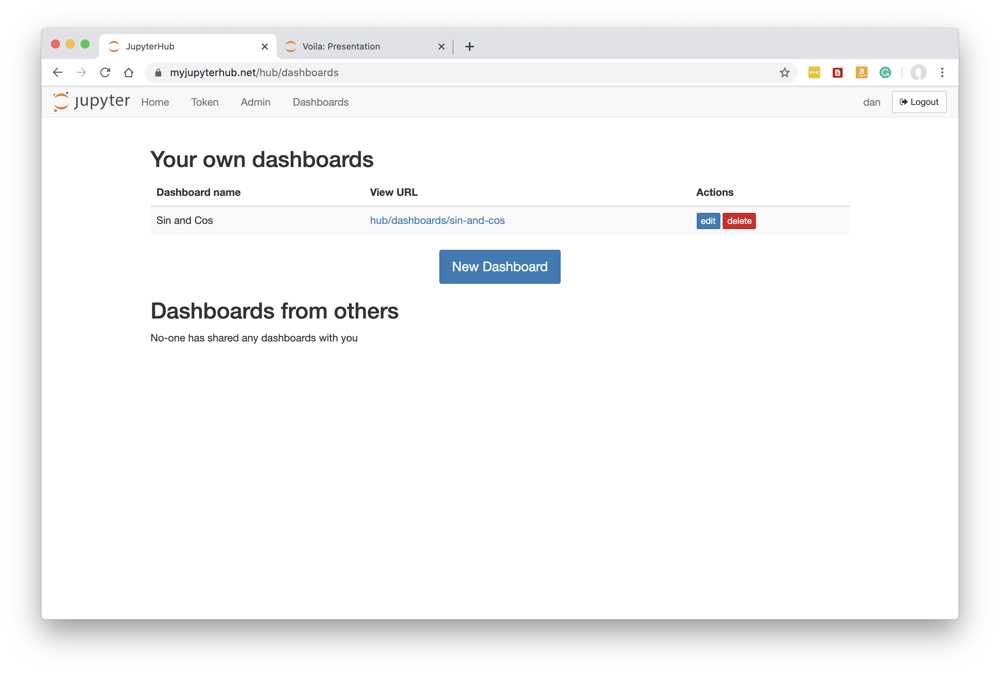
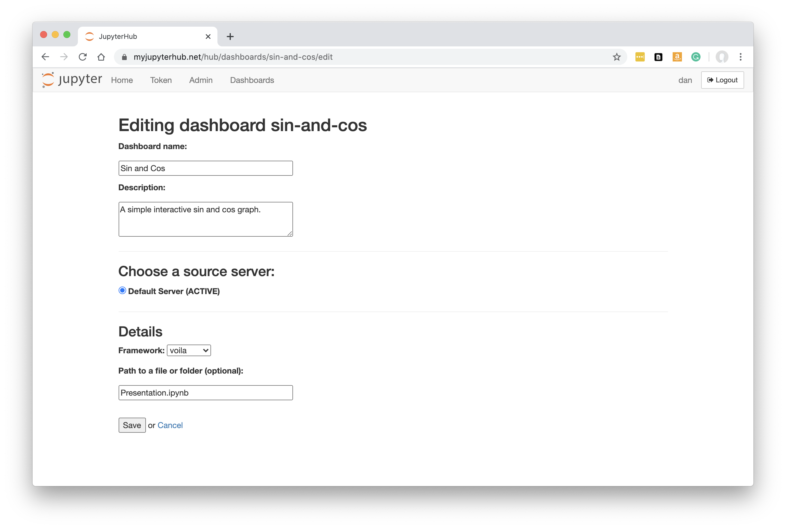
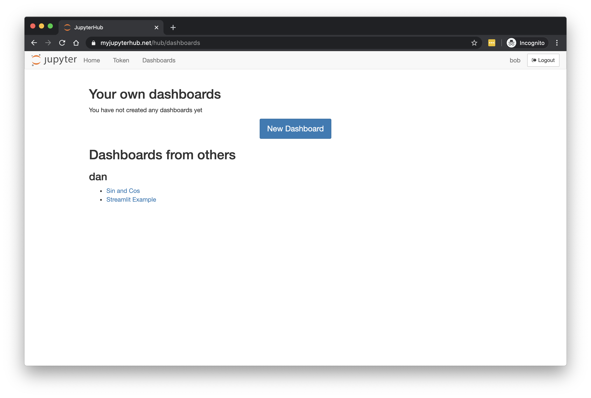
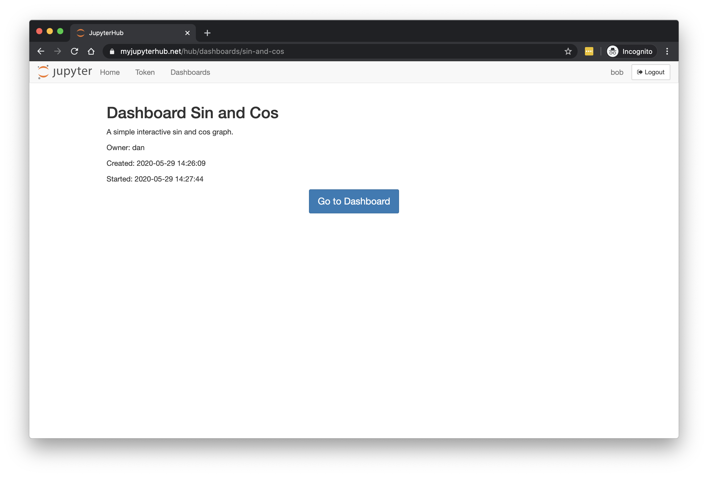
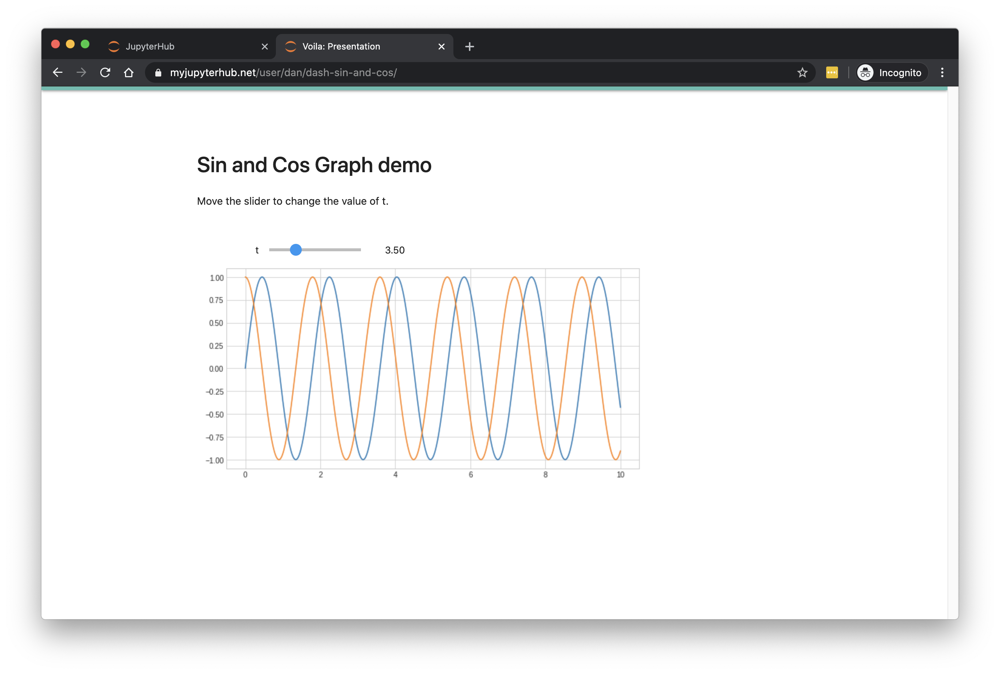

.. _userguide:

User Guide
----------

Once :ref:`setup<setup>` your JupyterHub have a new Dashboards menu. It will also have a Named Server section if this wasn't enabled 
previously (or hidden in :ref:`options<options>`).

.. figure:: ../../_static/screenshots/userguide/NamedServers.png
   :alt: JupyterHub with Dashboards

Developing a Dashboard
~~~~~~~~~~~~~~~~~~~~~~

Dashboards can be created based on either Jupyter notebooks or Streamlit py files.

Use 'My Server' (or a named server) to create a Jupyter notebook (ipynb file) as normal or upload/edit Python files to make your Streamlit app.

Below, we have both an ipynb (Jupyter notebook) and a py file. We will be able to make two dashboards, one for each file.

.. figure:: ../../_static/screenshots/userguide/JupyterTree.png
   :alt: Jupyter with ipynb and py files

For Jupyter notebooks, of course you can run them as usual in your Jupyter server - and there is a 'Voila Preview' button so you can see how 
the final dashboard will appear. Voila is the name of the technology that is essentially a user-friendly and secure version of Jupyter notebooks: 
code cells are hidden, and the user can only view the intended end result. They can interact with widgets if they are present in the notebook though.

Streamlit apps can't normally be run at this stage (in Jupyter), so for now you would upload Python files and data that you have developed on 
your own machine.

Click 'Control Panel' to go back to JupyterHub.

New Dashboard
~~~~~~~~~~~~~

Click 'Dashboards' in the menu bar. You will see the empty page showing any Dashboards created by you, or shared with you by colleages.

Below, in a fresh installation of ContainDS Dashboards, there are no Dashboards:

.. figure:: ../../_static/screenshots/userguide/EmptyDashboards.png
   :alt: Empty Dashboards screen

Click 'New Dashboard'.

Fill in a name and optionally a description.

The default My Server should already be selected as the source. If you have other named servers they should be available here. Unless 
different servers are likely to have different files or packages installed, it probably won't make much difference which server is selected 
as the source anyway - most JupyterHubs will share the user's home file system across the different servers, so the Dashboard will 
be able to locate your notebooks and files.

Select the framework required. For our Jupyter notebook (ipynb) file, we need to leave this as 'voila'.

Specify the URL-path to the ipynb file, relative to the Jupyter server's home folder. In our case, Presentation.ipynb was at the top level in our 
Jupyter tree, so we just enter Presentation.ipynb. It is important to get this right as file-not-found error messages are not currently propagated 
back up to JupyterHub easily. If in doubt, leave blank and Voila will just show the entire tree to the Dashboard user so they can locate the 
file themselves.

**Note that your Dashboard will be accessible by any other JupyterHub user.**

Click 'Save'.

Building the Dashboard
~~~~~~~~~~~~~~~~~~~~~~

When you click Save, the dashboard will be built automatically. This just means that a new named server is created based on your new Dashboard, 
running Voila instead of the regular Jupyter server.

This is what you should see while the build is taking place:

Any errors during the build will be visible here.

Once the Dashboard is built, click the 'Go to Dashboard' button to open the dashboard in a new tab.

The user-friendly and safe version of the notebook is displayed:

Running and Rebuilding Dashboards
~~~~~~~~~~~~~~~~~~~~~~~~~~~~~~~~~

Back in the Home page in JupyterHub, you can see that the Dashboard is really just running a new Jupyter server (albeit one runnning Voila instead 
of the regular Jupyter server):

.. figure:: ../../_static/screenshots/userguide/DashboardNamedServer.png
   :alt: Dashboard Named Server

You can try Stopping (and optionally Deleting) this server. If you then go to Dashboards you can still see the Dashboard definition:

If you then click into the View URL, the Dashboard will build again, then you can click 'Go to Dashboard' once ready just as before.

A Dashboard will also be forced to rebuid if you edit it for any reason.

Editing a Dashboard
~~~~~~~~~~~~~~~~~~~

From the Dashboards page, click 'edit' by the dashboard to see its definition again:

You can change any of the settings, e.g. Description to change the text seen by others when they first click on the Dashboard in their 
own list (see below). Or you might need to change the 'Path to a file or folder'.

When you click Save the dashboard will be rebuilt as it was when you first set up the Dashboard definition.

Sharing a Dashboard
~~~~~~~~~~~~~~~~~~~

The Dashboard is automatically accessible to any other authenticated user.

If another user clicks on the Dashboards menu in JupyterHub, they will be able to see your Dashboard:

If they click on your Dashboard's name they will see the summary screen, just as you did when you first built the Dashboard:

In the case above, the Dashboard was already built and running, so it only remains for the user to click 'Go to Dashboard'. If the 
dashboard server had been stopped or deleted, the other user would be able to see the Dashboard being restarted and/or rebuilt, along 
with any error message if there was a problem.

Since it is not their server, ContainDS Dashboards will require the other user to authenticate into your server:

.. figure:: ../../_static/screenshots/userguide/OthersOAuth.png
   :alt: OAuth screen

When they accept, they will be able to see the results:

