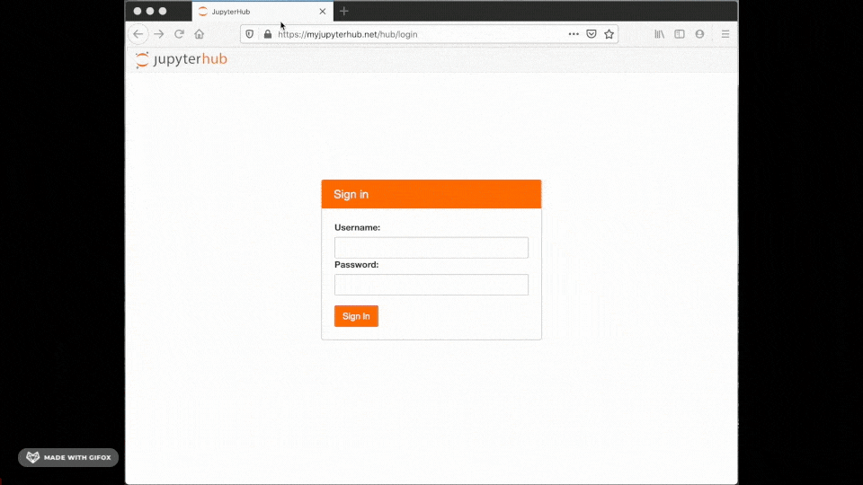

ContainDS Dashboards
====================

A Dashboard publishing solution for Data Science teams to share results with decision makers.

Run a private on-premise or cloud-based JupyterHub with extensions to instantly publish Jupyter notebooks (`Voilà <https://voila.readthedocs.io/en/stable/>`__), 
Streamlit, Plotly Dash, Bokeh / Panel, and R Shiny apps as user-friendly interactive dashboards to share with non-technical colleagues.

The `cdsdashboards <https://github.com/ideonate/cdsdashboards>`__ open source package allows data scientists to instantly and reliably publish interactive 
notebooks or other scripts as secure interactive web apps.

Selected JupyterHub users can view the dashboard, so for example this can be linked to single sign on through corporate email accounts.

Source files can be obtained from a Git repo, or directly from the dashboard publisher's Jupyter tree.

Read a full description in :ref:`overview`.

View `video on YouTube <https://youtu.be/iyryD2ngnx4>`__

JupyterHub
~~~~~~~~~~

JupyterHub is a way to run one website that provides Jupyter notebook environments to multiple users - your entire data science team, for example. 
To use ContainDS Dashboards, you will need a JupyterHub setup, but you don't need to use it as the main data science environment for your organisation. 
ContainDS Dashboards leverages the standardised security and authentication functionality of JupyterHub, which makes ContainDS Dashboards incredibly 
powerful, even if you don't believe your organisation requires a JupyterHub for any other purposes.

ContainDS
~~~~~~~~~

ContainDS is a data science platform for teams working on discrete projects. 
It provides simple infrastructure to share prototypes and dashboards based on any open source frameworks.

Your data scientists will always use their preferred development environments.

ContainDS Solutions will:

- Grant decision makers and clients easy access to actionable insights helping them move projects forward quickly and with confidence.
- Save time and reduce errors for your Data Science team, allowing them to focus on their core roles.
- Eliminate IT security threats from data science teams hosting web apps and sensitive data in arbitrary insecure cloud locations.
- Empower data scientists to use their dashboarding framework of choice while unifying your team’s approach to publishing.

Installation and Setup
~~~~~~~~~~~~~~~~~~~~~~

Once you have `set up JupyterHub <https://jupyterhub.readthedocs.io/en/stable/installation-guide.html>`__ on a server, you will install the 
cdsdashboards package and make some simple configuration changes to jupyterhub_config.py.

ContainDS Dashboards now works on single-server JupyterHubs and also Kubernetes-based depending on configuration. See :ref:`other requirements<requirements>`.

To continue installation please see :ref:`setup`.

Support and Mailing List
~~~~~~~~~~~~~~~~~~~~~~~~

Please contact `support@containds.com <mailto:support@containds.com>`__ with any comments or questions at all.

And there is a `Gitter room <https://gitter.im/ideonate/ContainDS?utm_source=badge&utm_medium=badge&utm_campaign=pr-badge&utm_content=badge>`__ 
for general chat with other community members.

Documentation Contents
~~~~~~~~~~~~~~~~~~~~~~

.. toctree::
   :maxdepth: 3

   chapters/overview
   chapters/setup/setup
   chapters/userguide/userguide
   chapters/customization/customization
   chapters/troubleshooting
   chapters/upgrading
   chapters/technical_and_legal/technical_and_legal
   chapters/changelog
   chapters/contact

ContainDS Dashboards source code can be found on `GitHub here <https://github.com/ideonate/cdsdashboards>`_.

